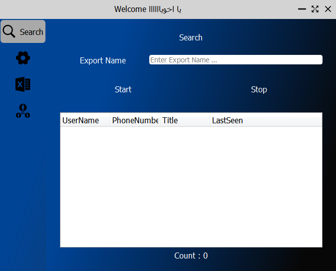
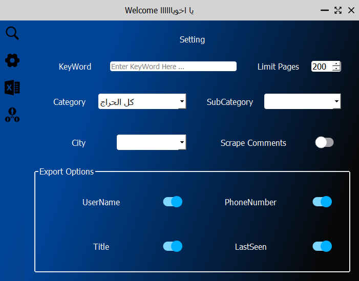
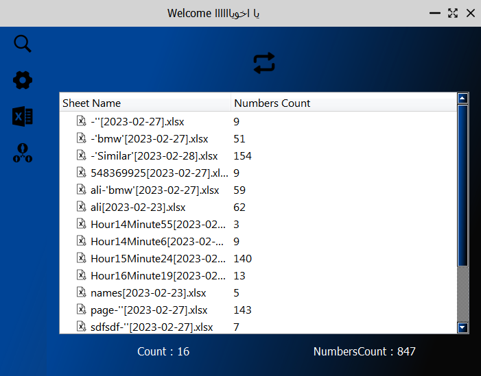
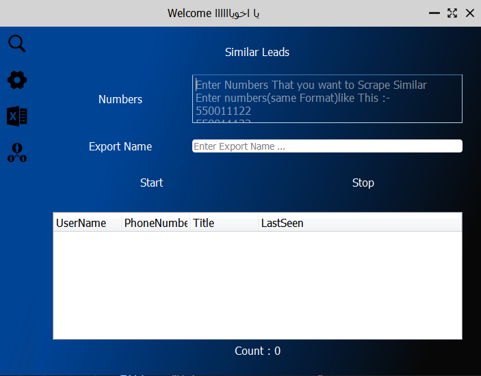

# Hiraj Scraper
Application that scrape saudi phone numbers from hiraj.com site and extract ads and user data 

# Project Photos

 

 

 

 

# Features v3.0 
* 1 - New Scrape Algorithm with Hiraj API
* 2 - Add Similar page to scrape similar posts
* 3 - Add Sheets page (to handling all sheets in export folder)
* 4 - Add more options in Setting page
* 5 - Add More Performance
* 6 - Increase Scrape speed
* 7 - No Browser

## Pages

* Search --> That Show Data from Search and write export name 
* Setting --> That handling setting in app with export options
* Sheets --> show all sheets in (Data/Exports) path and remote all sheets 
* Similar --> helps you to scrape similar ads from phone numbers 

 
## Frameworks 
* [PyQt5](https://doc.qt.io/qtforpython/)   For Build GUI 
* [Requests](https://requests.readthedocs.io/en/latest/)     For Requests Server
* [Pandas](https://pandas.pydata.org/)     For Data operations
* [Json](https://www.json.org/json-en.html)     For translate server messages

## Contact Me
* Email : [Heshammoawad120120@gmail.com]
* WhatsApp : [+201111141853] 
* [Linkedin](https://www.linkedin.com/in/hesham-moawad-916481244)

## License

Licensed under the [MIT License](LICENSE)

## Made By Hesham
#### You Can Only build .exe file with PyInstaller
